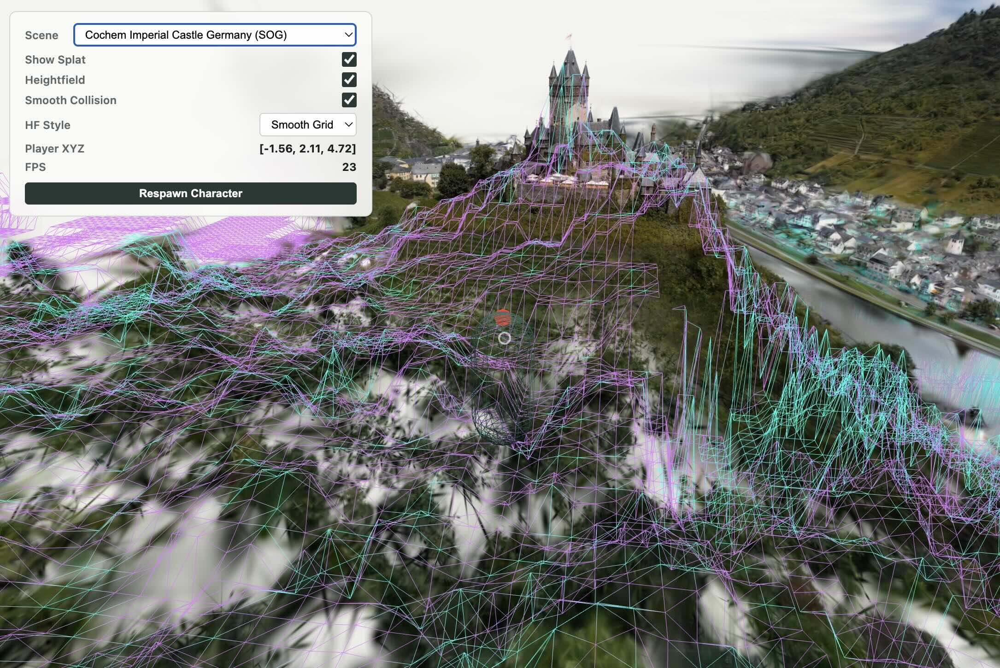
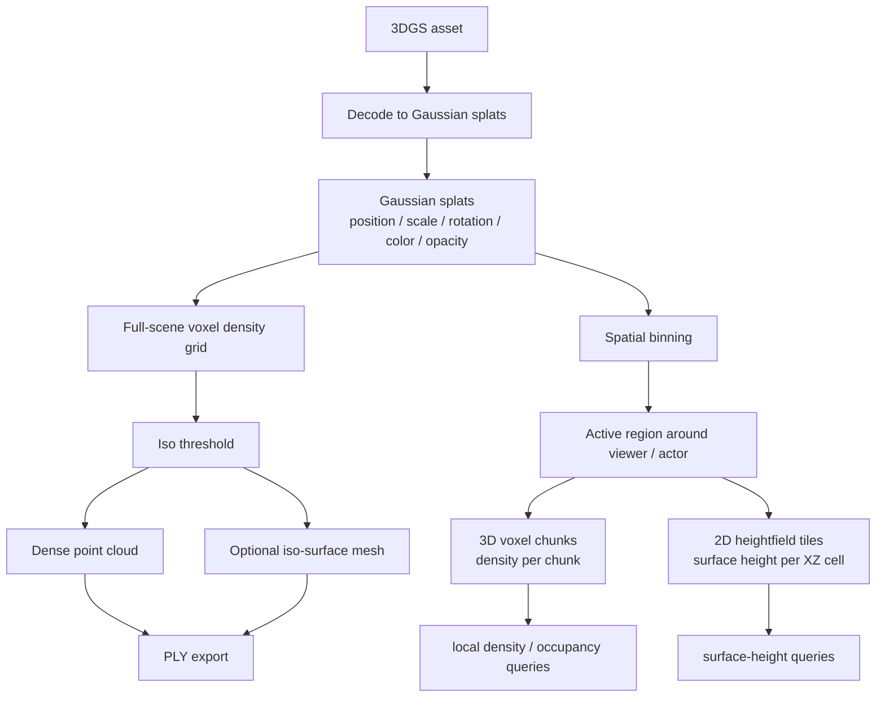

# Web 3DGS to Point Cloud

This repository is a browser-oriented prototype for converting 3D Gaussian
Splatting assets into dense point clouds and simple iso-surface meshes. The
current implementation has two execution paths:

- A Node CLI CPU baseline for `.splat` / Gaussian `.ply` inputs.
- A headless Chrome / browser pipeline that uses Spark 2.x to decode multiple 3D Gaussian Splatting formats (including `.sog`, `.spz`, `.splat`, `.ksplat`, and `.ply`) and WebGPU compute shaders to voxelize and sample a dense point cloud.

The outputs are binary little-endian PLY point clouds and, optionally, binary
PLY triangle meshes.

This project is based on
[Lewis-Stuart-11/3DGS-to-PC](https://github.com/Lewis-Stuart-11/3DGS-to-PC)
and adapts the 3DGS-to-PC idea for browser and headless WebGPU use.



## Installation

This package is intentionally not published to the npm registry. Install it
directly from GitHub instead.

```bash
npm install github:tatsuya-ogawa/Web-3DGS-to-PC
```

If your GitHub access is configured through SSH, use the SSH form:

```bash
npm install git+ssh://git@github.com:tatsuya-ogawa/Web-3DGS-to-PC.git
```

For reproducible installs, pin a branch, tag, or commit:

```bash
npm install github:tatsuya-ogawa/Web-3DGS-to-PC#main
npm install github:tatsuya-ogawa/Web-3DGS-to-PC#<commit-sha>
```

Or add it directly to your `package.json`:

```json
{
  "dependencies": {
    "web-3dgs-to-pc": "github:tatsuya-ogawa/Web-3DGS-to-PC#main"
  }
}
```

GitHub installs run the package `prepare` script, which builds `dist/` from the
TypeScript sources. Do not install this dependency with `--ignore-scripts`
unless you also provide a prebuilt `dist/` directory. Node.js 18 or newer is
recommended.

To install the CLI globally from GitHub:

```bash
npm install -g github:tatsuya-ogawa/Web-3DGS-to-PC
```

## Usage

### 1. Command Line Interface (CLI)

Once installed, you can use the CLI tool to convert `.splat` or Gaussian `.ply` files directly:

```bash
# Run the locally installed package binary
npm exec web-3dgs-to-pc -- input.splat -o output.ply --resolution 128

# Or use the global command after npm install -g
web-3dgs-to-pc input.splat -o output.ply --resolution 128
```

For all CLI parameters and flags, view the help screen:

```bash
web-3dgs-to-pc --help
```

### 2. Node.js Library API (CPU Path)

Import the CPU-based conversion pipeline to process Gaussian Splatting files in your server-side Node.js applications:

```typescript
import {
  loadGaussianSplats,
  voxelizeGaussianDensity,
  extractPointCloudFromVoxels,
  writePointCloudPly
} from 'web-3dgs-to-pc';
import { writeFile } from 'node:fs/promises';

// 1. Load Gaussian Splats (.splat or Gaussian .ply)
const splats = await loadGaussianSplats('input.splat');

// 2. Voxelize Splats into a Density Grid
const grid = voxelizeGaussianDensity(splats, {
  resolution: 128,
  sigmaRadius: 3,
});

// 3. Extract Point Cloud using Voxel Density Threshold
const pointCloud = extractPointCloudFromVoxels(grid, {
  isoThreshold: 0.01,
  jitter: 0.35,
});

// 4. Save to Binary PLY format
const plyBuffer = writePointCloudPly(pointCloud);
await writeFile('output.ply', plyBuffer);
```

### 3. Browser Library API (WebGPU Path)

For high-performance browser applications, you can import and run the WebGPU-accelerated pipeline to generate point clouds or extract triangle meshes on the GPU. 

This library is completely decoupled from `@sparkjsdev/spark` at compile-time. Instead, it defines a structural interface `SplatDataSource`. Any object matching this interface (such as a Spark `SplatMesh` instance) can be passed directly, or you can inject Spark's `SplatMesh` class into the loader:

```typescript
import { SplatMesh } from '@sparkjsdev/spark'; // Spark is imported in your application code
import {
  decodePackedSplats,
  packSplats,
  voxelizeWithWebGpu,
  writePointCloudPlyBytes
} from 'web-3dgs-to-pc/browser';

// Option A: Load and pack in one step by injecting the SplatMesh class
const { packed } = await decodePackedSplats(
  SplatMesh, // Inject the class constructor
  fileBytes,
  'scene.sog',
  false,       // extSplats
  50000,       // maxSplats (optional)
  0.01         // boundsQuantile
);

// Option B: Or manually pack any object matching the SplatDataSource interface
// (This works seamlessly out of the box with any Spark SplatMesh instance!)
const packedSplats = packSplats(mySplatMeshInstance, 50000, 0.01);

// 2. Run WebGPU Compute Shaders to Voxelize and Generate Points
const result = await voxelizeWithWebGpu(packedSplats, {
  resolution: 128,
  maxPoints: 50000,
  iso: 0.001
});

// 3. Get Point Cloud in Binary PLY bytes
const plyBytes = writePointCloudPlyBytes(result.pointCloud);
```

---

## Local Development & Quick Start

If you are developing this repository locally, follow these steps to build and test:

1. **Install dependencies and compile TypeScript:**
   ```bash
   npm install
   npm run build
   ```

2. **Run local CLI conversion (CPU Baseline):**
   ```bash
   npm run convert -- input.splat --resolution 128 --iso-percentile 0.85 -o output.ply
   ```

3. **Run headless Chrome WebGPU pipeline (using Playwright):**
   ```bash
   npm run headless:install
   npm run headless:build
   npm run headless:run -- path/to/scene.sog --resolution 128 --max-points 50000
   ```

4. **Launch interactive browser demo app:**
   ```bash
   npm run examples:install
   npm run examples:dev
   ```
   Open the output local URL, choose a `.sog` scene or a local file, run the conversion, and export point or mesh PLY files from the browser UI.


## Architecture

The important internal shape is not the source file format. Once an asset is
decoded, the system treats it as Gaussian splats and builds spatial data from
those splats:

- a full-scene voxel density grid for point-cloud and mesh export
- chunked voxel grids for active regions of the scene
- support heightfields for fast surface-height queries



Each Gaussian contributes density to nearby voxels inside its `sigmaRadius`
support. This produces a scalar field that can be thresholded into occupied
space:

```text
density += opacity * densityScale * exp(-0.5 * mahalanobis_distance^2)
```

For export, the whole bounded scene can be voxelized at once. The iso threshold
selects occupied voxels, dense point clouds are sampled from them, and optional
meshes are extracted from the same scalar field.

For interactive use, the splats are spatially binned first. The active region
around the viewer or actor is generated as small voxel chunks instead of one
large scene grid. Each chunk stores local density, and each support tile stores a
2D heightfield extracted from density columns. That makes ground/support queries
cheap without keeping every 3D voxel chunk resident at once.

This is still a density-field approximation, not a camera-aware reconstruction
pipeline. It does not estimate a true TSDF or run Poisson reconstruction. The
tradeoff is that `resolution`, `bounds-quantile`, `iso`, and chunk size directly
control the generated spatial data, so the behavior is predictable and suitable
for conversion, inspection, and lightweight runtime queries.

### Bounds Handling

Large `.sog` scenes can contain outlier centers. The headless runner defaults to:

```bash
--bounds-quantile 0.01
```

That trims the center bounds by quantile before voxelization, so the grid resolution is spent on the main scene instead of distant outliers. Set `--bounds-quantile 0` to disable trimming.

### Mesh Extraction

Mesh export is intended as a quick verification surface, not a final
reconstruction algorithm. It uses marching tetrahedra, which is a compact
marching-cubes-family method that splits each grid cube into six tetrahedra and
linearly interpolates the iso crossing. This avoids a large marching-cubes
lookup table while producing a standard triangle mesh that can be opened in
Blender, MeshLab, CloudCompare, or other PLY viewers.

The mesh is extracted from the same scalar density grid as the dense point cloud,
so `--iso`, `--iso-percentile`, `--resolution`, and `--bounds-quantile` affect
both outputs.

### PLY Output

The browser path encodes binary PLY bytes in [src/browser/ply.ts](./src/browser/ply.ts), returns them to Node as base64, and [tests/headless/src/headless.ts](./tests/headless/src/headless.ts) writes the file.

The CPU path uses [src/io/ply.ts](./src/io/ply.ts).

## Reference: Original 3DGS-to-PC Implementation

This project is based on
[Lewis-Stuart-11/3DGS-to-PC](https://github.com/Lewis-Stuart-11/3DGS-to-PC),
the Python/CUDA implementation for converting 3D Gaussian Splatting scenes into
dense point clouds and meshes. The original repository is Apache-2.0 licensed
and accompanies the 3DGS-to-PC ICCVW 2025 work.

This prototype keeps the same high-level goal, but changes the implementation
so it can run in browser and headless WebGPU contexts.

Relevant original pipeline stages:

- Gaussian `.ply` / `.splat` loading and PLY point-cloud writing.
- Scale + rotation conversion into covariance, Gaussian filtering, and
  magnitude estimation.
- Point-count distribution and dense point sampling from Gaussians.
- Render-based contribution and color estimation.
- CUDA rasterization for contribution and surface-distance signals.
- Open3D cleanup and Poisson mesh reconstruction.

Important differences from the original Python/CUDA pipeline:

- This prototype uses Spark to decode web-focused formats such as `.sog`.
- It does not currently render camera views to recover contribution-weighted colors.
- It does not compute the CUDA surface-distance signal from the original rasterizer.
- It uses voxel density thresholding as a browser-friendly proxy for surface extraction.
- Mesh export is marching-tetrahedra iso-surfacing over that density grid, not
  Open3D Poisson reconstruction.

## Headless WebGPU Notes

The headless runner starts a local Vite server and launches Chrome through Playwright:

```bash
npm run headless:run -- path/to/scene.sog --resolution 128 --max-points 50000
```

Chrome is launched with WebGPU flags from [tests/headless/src/headless.ts](./tests/headless/src/headless.ts). On the tested machine, the adapter reported:

```text
apple / metal-3
```

Useful options:

- `--resolution`: longest-axis voxel grid resolution.
- `--max-points`: number of dense output points.
- `--mesh-output`: optional mesh PLY generated from the density iso-surface.
- `--iso`: explicit density threshold.
- `--iso-percentile`: threshold from non-zero density percentile when `--iso` is omitted.
- `--bounds-quantile`: robust bounds trimming for scenes with outliers.
- `--max-splats`: limit decoded splats for quick tests.
- `--headed`: launch a visible Chrome window for debugging.

## License

This project is licensed under the Apache License 2.0 - see the [LICENSE](LICENSE) file for details.
